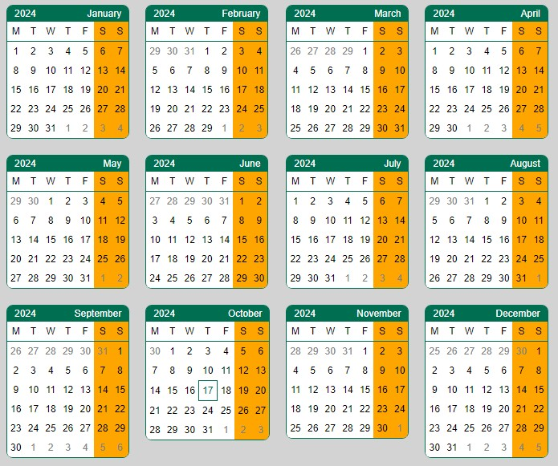
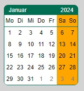
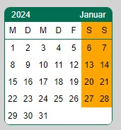
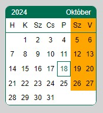

# Simple Calendar (made with Lit Element)

Version: 1.0.1

Author: Károly Kótay-Szabó (gl0b3)

Project source: https://github.com/gl0b3/simple-calendar

## Overview

The Simple Calendar module is designed to visually displaying a month or all months of a given year in table form.
The components can be imported into your own (Javascript) program and can be customized in terms of date and style, including language localization.
If you want, you can use only the Month Calendar component or only the Year Calendar component or even both within a project.


Year Calendar for 2024 in English with 'year-is-first' option and narrowed weekdays format:



## Used technologies

* Lit: for making fast and lightweight web components, more info: https://lit.dev/docs/
* Luxon: library for easier date and locale usage. More info: https://moment.github.io/luxon/api-docs/index.html .
For supported locales see: https://github.com/moment/luxon/blob/master/docs/intl.md
* Typescript: for making the JS world easier. More info: https://www.typescriptlang.org/ . TSC used to compile from TypeScript to Javascript.
* Vite: for building (rolling up) and serving the project as an example. More info: https://vite.dev/

## Usage

Whether you want to use `month-calendar` or `year-calendar`, you need to install `simple-calendar` for both, and then import the corresponding component.

Install the `simple-calendar`
```
npm i `@gl0b3/simple-calendar@1.0.0`
```

### Month Calendar usage



After the `simple-calendar` module install, import the `month-calendar` in your application:
```js
import 'simple-calendar/month-calendar.js';
```
Then use it in your application (generate the Janaury, 2024 with deutsch month and day text):
```html
<month-calendar year="2024" month="1" locale="de"></month-calendar>
```


or
```html
<month-calendar year="2024" month="10" locale="hu" year-is-first weekday-type="narrow"></month-calendar>
```


The default `locale` is 'en' (english) and the `year-is-first` is false, so the month is first, then the year follows. So if you don't provide them the default will be used. The year and the month attributes are mandatory for the month-calendar.
The `weekday-type` can take the following values: 'narrow', 'short', 'long'. Narrow is the shortest and long is the longest name for the days of the week. This attribute is optional, the default value is 'short'.
The another optional attribute is the `show-other-month-days`. It has boolean values. The default value is 'false'. If you use this attribute or set it 'true', then the the whole weeks will be shown, if you set to false (or don't use the attirbute) then only days which are in the current month will be visible. Ie.: first week of October 2024 begins on September 30, and last week ends with November 1, 2 and 3.

```html
<month-calendar year="2024" month="5"></month-calendar>
```

### Year Calendar usage

Or for the `year-calendar` usage (, after installed the `simple-calendar` module):
```js
import 'simple-calendar/year-calendar.js';
```
Then use it in your application:
```html
<year-calendar year="2024"></year-calendar>
```
or
```html
<year-calendar year="2024" locale="hu" year-is-first weekday-type="narrow"></year-calendar>
```
As mentioned in the month-calendar, the `locale` and the `year-is-first` are optionally. If you don't provide them the default will be used. The `year`attribute is mandatory.
The `weekday-type` is the same as it was for the month-calendar.

[For more spectacular exmaple, check out the demo](#demo)

## Customize styling

The componets use Shadow DOM and Shadow CSS, which means the classic styling cannot be applied. The use of CSS variables tries to overcome this difficulty.
The following variables are declared with initial values. If you want to customize, you have to modify the corresponding value in your application's `styles.css` (typically in the html { ... } or body { ... } part):

### Year Calendar customization

`year-calendar` has only a few CSS variables, it can only control the gaps between the `month-calendar`s:
```css
--year-month-gap-top: 0;
--year-month-gap-right: 20px;
--year-month-gap-bottom: 20px;
--year-month-gap-left: 0;
```

For example if you want to disable the gaps between the month calendars you can set the right and bottom gaps to zero too (as the initial top and left gaps are):
```css
--year-month-gap-right: 0;
--year-month-gap-bottom: 0;
```

### Month Calendar customization

The Month Calendar has many more setting options. The list of CSS variables can be found here:

`month-calendar` CSS variables are the following:
```css
--month-primary-color: #006E51;
--month-secondary-color: #FFA500;
--month-day-color: #000000;
--month-font-family: Arial;
--month-font-size: 12px;
--month-table-border: 1px solid var(--month-primary-color);
--month-table-border-radius: 8px 8px 8px 8px;
--month-table-last-row-bottom-radius: 0 0 8px 8px;
--month-last-row-border-bottom-left-radius: 0 0 0 6px;
--month-last-row-border-bottom-right-radius: 0 0 6px 0;
--month-day-cell-width: 1.8em;
--month-day-cell-height: 24px;
--month-day-font-weight: normal;
--month-day-background-color: #FFFFFF;
--month-day-user-select: none;
--month-today-background-color: #FFFFFF;
--month-today-color: var(--month-primary-color);
--month-today-border: var(--month-today-border-width, 1px) var(--month-today-border-style, solid) var(--month-today-color);
--month-today-user-select: none;
--month-weekdays-weekend-background-color: var(--month-secondary-color);
--month-weekdays-border-bottom: 1px solid var(--month-primary-color);
--month-weekdays-background-color: #FFFFFF;
--month-header-padding-top: 1px;
--month-header-padding-right: 4px;
--month-header-padding-bottom: 1px;
--month-header-padding-left: 4px;
--month-header-border-top-left-radius: 6px;
--month-header-border-top-right-radius: 6px;
--month-header-background-color: var(--month-primary-color);
--month-header-color: #ffffff;
--month-header-user-select: none;
--month-day-hover-color: inherit;
--month-day-hover-background-color: #D5D5D5;
--month-othermonth-day-color: #838383;
--month-inactive-day-background-color: #FFA500;
--month-important-day-background-color: var(--month-secondary-color);
--month-weeks-weekend-background-color: var(--month-secondary-color);
--month-box-shadow-color: #98A3AE;
--month-table-hover-box-shadow: 3px 3px 5px 0 var(--month-box-shadow-color);
--month-table-hover-transition: .1s ease-in-out;
--month-table-hover-scale: 1.05;
```

The names of the variables are self-explanatory, and in the browser's Developer mode, you can inspect which style and which variable applies to which element.

### Let's see some examples:

Change the base font of the library, like header's text, day, etc. to 'Verdana' ('sans-serif' for fallback safety) with size 14px:
```css
--month-font-family: Verdana, sans-serif;
--month-font-size: 14px;
```

Change the header background color to blue, the text color to gray and the border to 2px thick, solid style and blue color:
```css
--month-header-background-color: #065DAB;
--month-header-color: #C4C8CB;
--month-table-border: 2px solid #065DAB;
```

If you want to use a color for primary, set the following value (the header background color and the border color use this variable):
```css
--month-primary-color: #065DAB;
```

To change the weekend names color to light green:
```css
--month-weekdays-weekend-background-color: #96EAC8;
```

To change the weekend dates color to light blue:
```css
--month-weeks-weekend-background-color: #A1CCEB;
```

Weekend days use the secondary color, so changing the secondary color will affect to the weekend days color (if you don't modify the --month-weekend-background-color too). For example, the secondary color can be the previous light blue:
```css
--month-secondary-color: #A1CCEB;
```

Turn off the table's hover animation:
```css
--month-table-hover-transition: none;
--month-table-hover-scale: none;
```

If you don't want to use box shadow when hover over the table, you can turn off:
```css
--month-table-hover-box-shadow: none;
```

## Setup for local

Install dependencies:

Needless to say, the library requires `Node.js` and `npm` to properly work. For more info: https://docs.npmjs.com/about-npm .

Pull the source code from GitHub, then in the project root install the dependencies:

```bash
npm install
```
or shorter form:
```bash
npm i
```

Once the dependencies are installed, you're ready to compile and run the demo or preview your project changes.

## Demo

### Build locally

This project uses the TypeScript compiler to produce JavaScript from Typescript that can run in the browser.

To build the JavaScript version of your component, run build from the project root:

```bash
npm run build
```

After the build has run, the `dist` directory is created and the files needed for the demo are also created in it.

### Run the demo locally

To run the demo locally, type the following command and then open the demo in the browser (the default URL is http://localhost:5173/):

```bash
npm run dev
```

**_NOTE:_** if you manually load the index.html in the browser from the project folder, it probably won't work. So it is recommended to run Vite Dev Server instead as mentioned above.

## Known limitations

- The week starts on Monday and ends on Sunday, as I think it normally should (ISO 8601). Some nations still do not use this due to their tradition, but this is not currently supported by the program. Perhaps in the future it will be possible to configure this as well.
- The layout of the year is fixed, the months are displayed in 3 rows and 4 columns in tabular form. This is currently not customizable either. If you want to display it differently, the solution may be to pack 12 individual months from January to December and display them as you like with HTML and CSS options.
- Limitations due to Shadow DOM and Shadow CSS. If you want to customize the look more, you can use Javascript to get into the shadow CSS.

## License

The project uses Apache 2.0 license. For more info see the LICENSE file.

## More information

See the links on the top of the page.
